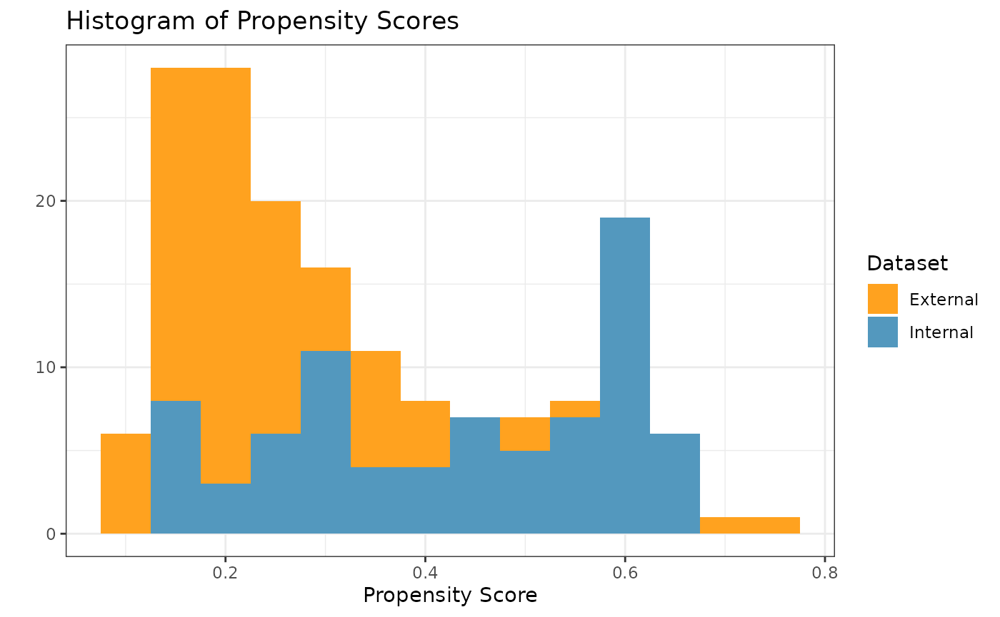
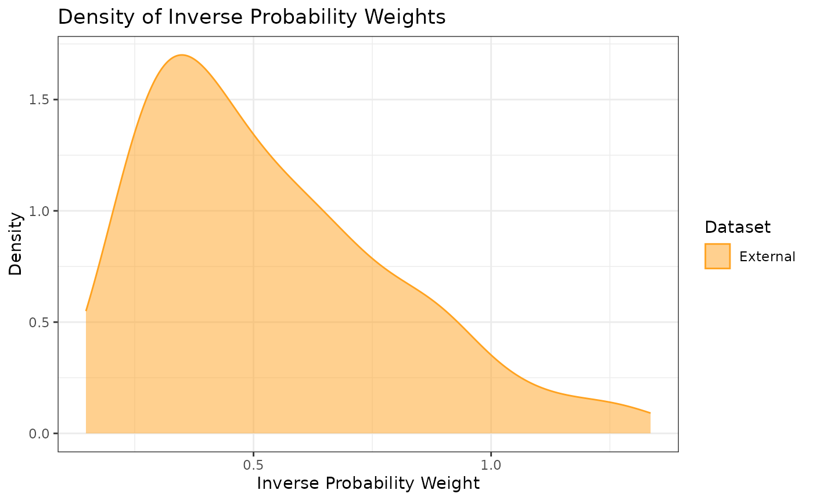
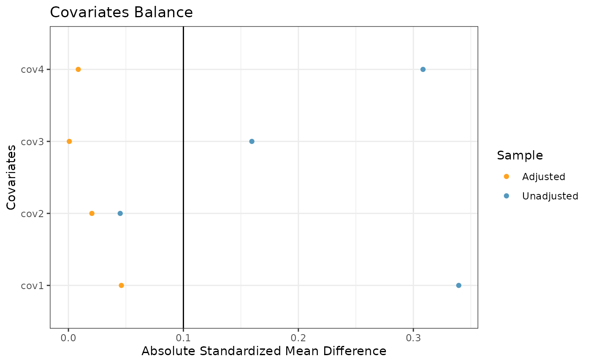
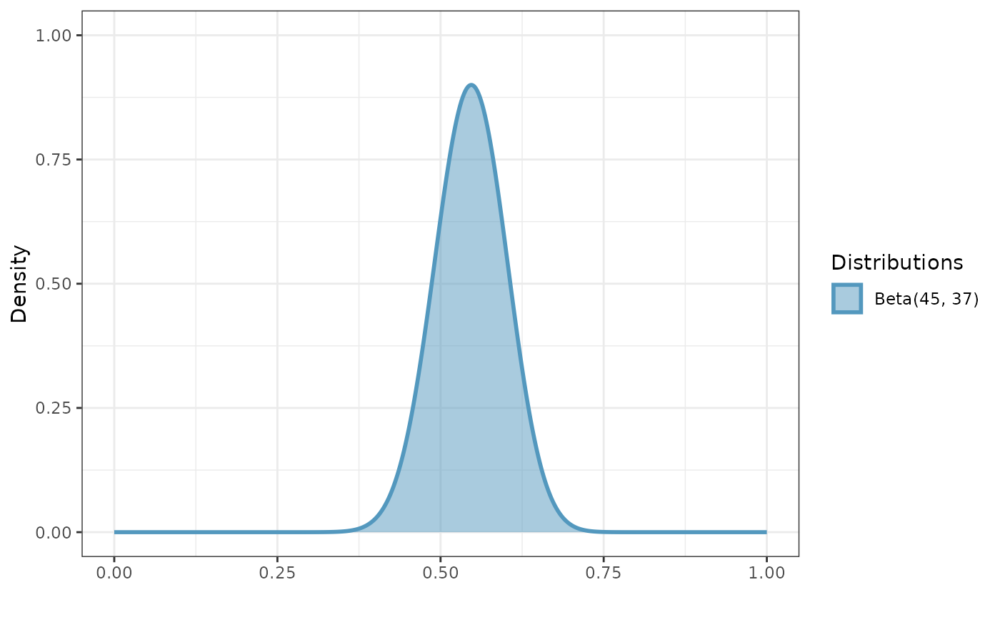
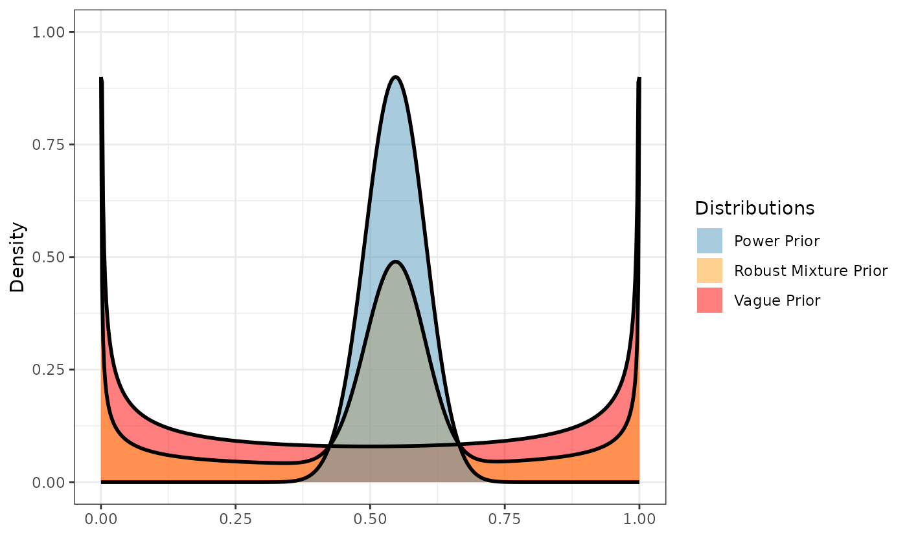
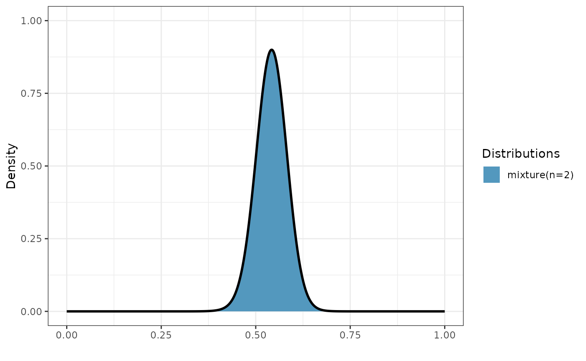
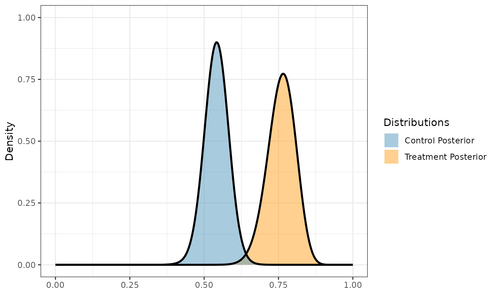
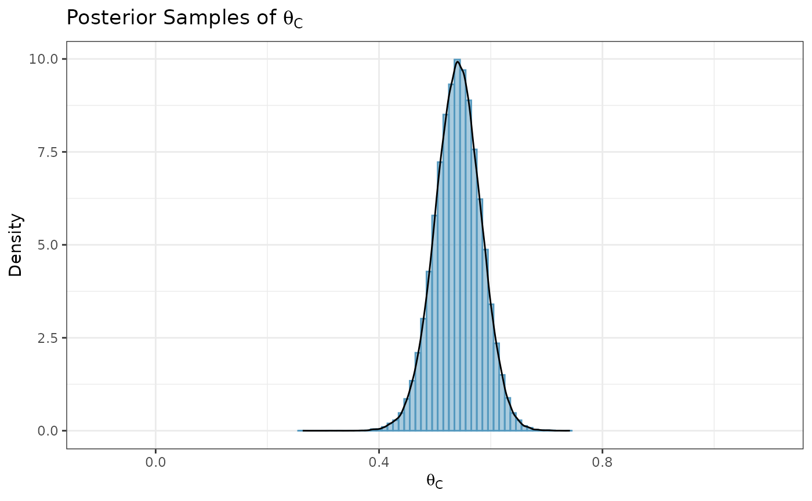
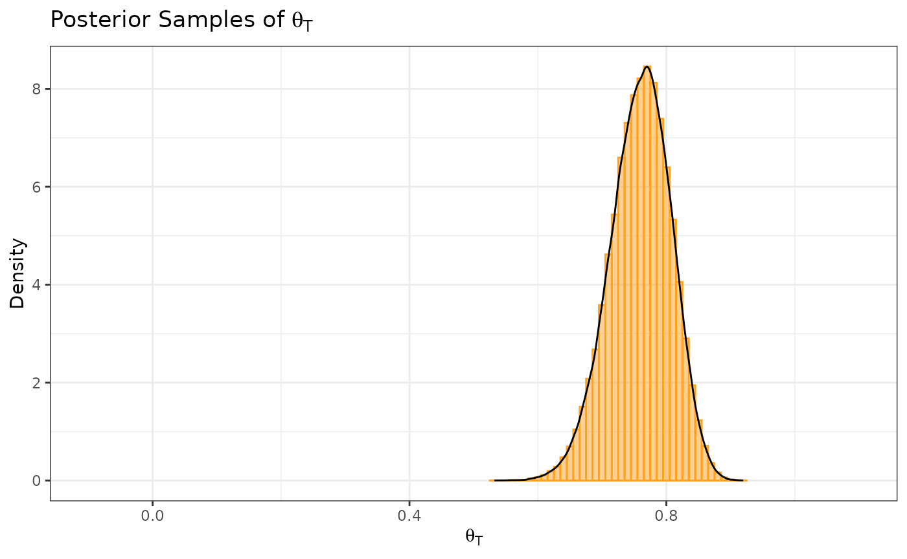
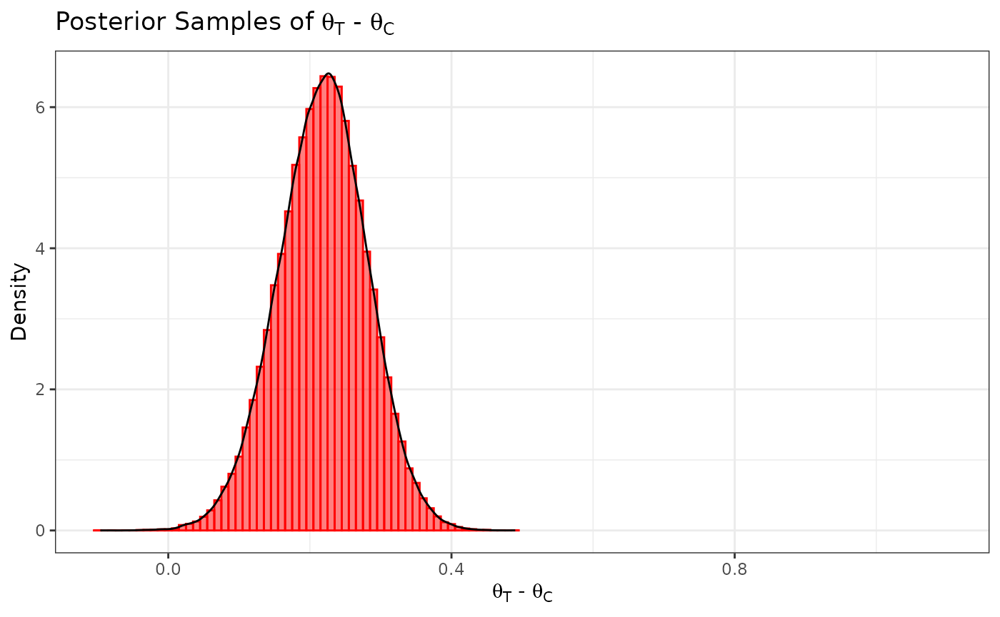

# Binary Outcome

## Introduction

In this example, we illustrate how to use Bayesian dynamic borrowing
(BDB) with the inclusion of inverse probability weighting to balance
baseline covariate distributions between external and internal datasets
(Psioda et al., [2025](https://doi.org/10.1080/10543406.2025.2489285)).
This particular example considers a hypothetical trial with a binary
outcome, and our objective is to use BDB with IPWs to construct a
posterior distribution for the control response rate $\theta_{C}$.

## Data Description

We will use simulated internal and external datasets from the package
where each dataset has a binary response variable (1: positive response;
0: otherwise) and four baseline covariates which we will balance.

The external control dataset has a sample size of 150 participants, and
the distributions of the four covariates are as follows:

- Covariate 1: normal with a mean and standard deviation of
  approximately 65 and 10, respectively

- Covariate 2: binary (0 vs. 1) with approximately 30% of participants
  with level 1

- Covariate 3: binary (0 vs. 1) with approximately 40% of participants
  with level 1

- Covariate 4: binary (0 vs. 1) with approximately 50% of participants
  with level 1

The internal dataset has 160 participants with 80 participants in each
of the control arm and the active treatment arms. The covariate
distributions of each arm are as follows:

- Covariate 1: normal with a mean and standard deviation of
  approximately 62 and 8, respectively

- Covariate 2: binary (0 vs. 1) with approximately 40% of participants
  with level 1

- Covariate 3: binary (0 vs. 1) with approximately 40% of participants
  with level 1

- Covariate 4: binary (0 vs. 1) with approximately 60% of participants
  with level 1

``` r
library(beastt)
library(distributional)
library(dplyr)
#> 
#> Attaching package: 'dplyr'
#> The following objects are masked from 'package:stats':
#> 
#>     filter, lag
#> The following objects are masked from 'package:base':
#> 
#>     intersect, setdiff, setequal, union
library(ggplot2)
set.seed(1234)

summary(int_binary_df)
#>      subjid            cov1            cov2             cov3       
#>  Min.   :  1.00   Min.   :46.00   Min.   :0.0000   Min.   :0.0000  
#>  1st Qu.: 40.75   1st Qu.:57.00   1st Qu.:0.0000   1st Qu.:0.0000  
#>  Median : 80.50   Median :62.00   Median :0.0000   Median :0.0000  
#>  Mean   : 80.50   Mean   :61.83   Mean   :0.3688   Mean   :0.3625  
#>  3rd Qu.:120.25   3rd Qu.:67.00   3rd Qu.:1.0000   3rd Qu.:1.0000  
#>  Max.   :160.00   Max.   :85.00   Max.   :1.0000   Max.   :1.0000  
#>       cov4             trt            y       
#>  Min.   :0.0000   Min.   :0.0   Min.   :0.00  
#>  1st Qu.:0.0000   1st Qu.:0.0   1st Qu.:0.00  
#>  Median :1.0000   Median :0.5   Median :1.00  
#>  Mean   :0.5563   Mean   :0.5   Mean   :0.65  
#>  3rd Qu.:1.0000   3rd Qu.:1.0   3rd Qu.:1.00  
#>  Max.   :1.0000   Max.   :1.0   Max.   :1.00
summary(ex_binary_df)
#>      subjid            cov1            cov2             cov3       
#>  Min.   :  1.00   Min.   :37.00   Min.   :0.0000   Min.   :0.0000  
#>  1st Qu.: 38.25   1st Qu.:58.00   1st Qu.:0.0000   1st Qu.:0.0000  
#>  Median : 75.50   Median :64.00   Median :0.0000   Median :0.0000  
#>  Mean   : 75.50   Mean   :64.28   Mean   :0.3533   Mean   :0.4533  
#>  3rd Qu.:112.75   3rd Qu.:70.00   3rd Qu.:1.0000   3rd Qu.:1.0000  
#>  Max.   :150.00   Max.   :90.00   Max.   :1.0000   Max.   :1.0000  
#>       cov4              y         
#>  Min.   :0.0000   Min.   :0.0000  
#>  1st Qu.:0.0000   1st Qu.:0.0000  
#>  Median :0.0000   Median :1.0000  
#>  Mean   :0.4733   Mean   :0.5133  
#>  3rd Qu.:1.0000   3rd Qu.:1.0000  
#>  Max.   :1.0000   Max.   :1.0000
```

## Propensity Scores and Inverse Probability Weights

With the covariate data from both the external and internal datasets, we
can calculate the propensity scores and ATT inverse probability weights
(IPWs) for the internal and external control participants using the
`calc_prop_scr` function. This creates a propensity score object which
we can use for calculating an inverse probability weighted power prior
in the next step.

**Note: when reading external and internal datasets into
`calc_prop_scr`, be sure to include only the arms in which you want to
balance the covariate distributions (typically the internal and external
control arms).** In this example, we want to balance the covariate
distributions of the external control arm to be similar to those of the
internal control arm, so we will exclude the internal active treatment
arm data from this function.

``` r
ps_obj <- calc_prop_scr(internal_df = filter(int_binary_df, trt == 0),
                        external_df = ex_binary_df,
                        id_col = subjid,
                        model = ~ cov1 + cov2 + cov3 + cov4)
ps_obj
#> 
#> ── Model ───────────────────────────────────────────────────────────────────────
#> • cov1 + cov2 + cov3 + cov4
#> 
#> ── Propensity Scores and Weights ───────────────────────────────────────────────
#> • Effective sample size of the external arm: 81
#> # A tibble: 150 × 4
#>    subjid Internal `Propensity Score` `Inverse Probability Weight`
#>     <int> <lgl>                 <dbl>                        <dbl>
#>  1      1 FALSE                 0.333                        0.500
#>  2      2 FALSE                 0.288                        0.405
#>  3      3 FALSE                 0.539                        1.17 
#>  4      4 FALSE                 0.546                        1.20 
#>  5      5 FALSE                 0.344                        0.524
#>  6      6 FALSE                 0.393                        0.646
#>  7      7 FALSE                 0.390                        0.639
#>  8      8 FALSE                 0.340                        0.515
#>  9      9 FALSE                 0.227                        0.294
#> 10     10 FALSE                 0.280                        0.389
#> # ℹ 140 more rows
#> 
#> ── Absolute Standardized Mean Difference ───────────────────────────────────────
#> # A tibble: 4 × 3
#>   covariate diff_unadj diff_adj
#>   <chr>          <dbl>    <dbl>
#> 1 cov1          0.339  0.0461  
#> 2 cov2          0.0450 0.0204  
#> 3 cov3          0.160  0.000791
#> 4 cov4          0.308  0.00857
```

In order to check the suitability of the external data, we can create a
variety of diagnostic plots. The first plot we might want is a histogram
of the overlapping propensity score distributions from both datasets. To
get this, we use the `prop_scr_hist` function. This function takes in
the propensity score object made in the previous step, and we can
optionally supply the variable we want to look at (either the propensity
score or the IPW). By default, it will plot the propensity scores.
Additionally, we can look at the densities rather than histograms by
using the `prop_scr_dens` function. When looking at the IPWs with either
the histogram or the density functions, it is important to note that
only the IPWs for external control participants will be shown because
the ATT IPWs for all internal control participants are equal to 1.

``` r
prop_scr_hist(ps_obj)
```



``` r
prop_scr_dens(ps_obj, variable = "ipw")
```



The final plot we might want to look at is a love plot to visualize the
absolute standardized mean differences (both unadjusted and adjusted by
the IPWs) of the covariates between the internal and external data. To
do this, we use the `prop_scr_love` function. Like the previous
function, the only required parameter for this function is the
propensity score object, but we can also provide a location along the
x-axis for a vertical reference line.

``` r
prop_scr_love(ps_obj, reference_line = 0.1)
```



## Inverse Probability Weighted Power Prior

Now that we have created and assessed our propensity score object, we
can read it into the `calc_power_prior_beta` function to calculate a
beta inverse probability weighted power prior for $\theta_{C}$. To
calculate the power prior, we need to supply the following information:

- weighted object (the propensity score object we created above)

- response variable name (in this case $y$)

- initial prior, in the form of a beta distributional object (e.g.,
  $\text{Beta}(0.5,0.5)$)

Once we have a power prior, we might want to plot it. To do that, we use
the `plot_dist` function.

``` r
pwr_prior <- calc_power_prior_beta(ps_obj,
                                   response = y,
                                   prior = dist_beta(0.5, 0.5))
plot_dist(pwr_prior)
```



## Inverse Probability Weighted Robust Mixture Prior

We can robustify the beta power prior for $\theta_{C}$ by adding a vague
component to create a robust mixture prior (RMP). We define the vague
component to be a $\text{Beta}(0.5,0.5)$ prior, and we use the
`dist_mixture` function from the `distributional` package to construct
the RMP with 0.5 weight on each component. With this function, we can
name the different components of our RMP (e.g., “informative” and
“vague”). In general, we can define our prior to be a mixture
distribution with an arbitrary number of beta components.

``` r
vague_prior <- dist_beta(0.5, 0.5)
mix_prior <- dist_mixture(informative = pwr_prior,
                          vague = vague_prior,
                          weights = c(0.5, 0.5))
plot_dist("Power Prior" = pwr_prior,
          "Vague Prior" = vague_prior,
          "Robust Mixture Prior" = mix_prior)
```



## Posterior Distributions

To create a posterior distribution for $\theta_{C}$, we can pass the
resulting RMP to the `calc_post_beta` function. We see that the
resulting posterior distribution is also a mixture of beta components.

**Note: when reading internal data directly into `calc_post_beta`, be
sure to include only the arm of interest (e.g., the internal control arm
if creating a posterior distribution for $\theta_{C}$).**

``` r
post_control <- calc_post_beta(filter(int_binary_df, trt == 0),
                               response = y,
                               prior = mix_prior)
plot_dist(post_control)
```



Next, we create a posterior distribution for the response rate of the
active treatment arm $\theta_{T}$ by reading the internal data for the
corresponding arm into the `calc_post_beta` function. In this case, we
assume a vague beta prior.

**As noted earlier, be sure to read in only the data for the internal
active treatment arm while excluding the internal control data.**

``` r
post_treated <- calc_post_beta(internal_data = filter(int_binary_df, trt == 1),
                               response = y,
                               prior = vague_prior)
plot_dist("Control Posterior" = post_control,
          "Treatment Posterior" = post_treated)
```



## Posterior Summary Statistics and Samples

With our posterior distributions for $\theta_{C}$ and $\theta_{T}$ saved
as distributional objects, we can use several functions from the
`distributional` package to calculate posterior summary statistics and
sample from the distributions. Using the posterior distribution for
$\theta_{C}$ as an example, we illustrate several of these functions
below.

- Posterior summary statistics:

``` r
c(mean = mean(post_control),
  median = median(post_control),
  variance = variance(post_control))
#>        mean      median    variance 
#> 0.541262322 0.541589059 0.001697325
```

- Highest density regions using the `hdr` function:

``` r
hdr(post_control)        # 95% HDR
#> <hdr[1]>
#> [1] [0.4605526, 0.621634]95
hdr(post_control, 90)    # 90% HDR
#> <hdr[1]>
#> [1] [0.4740822, 0.6087946]90
```

- Credible intervals using either the `hilo` function or the `quantile`
  function:

``` r
hilo(post_control)       # 95% credible interval
#> <hilo[1]>
#> [1] [0.4594412, 0.6211411]95
hilo(post_control, 90)   # 90% credible interval
#> <hilo[1]>
#> [1] [0.4732915, 0.6081643]90
quantile(post_control, c(.025, .975))[[1]]    # 95% CrI via quantile function
#> [1] 0.4594412 0.6211411
```

- Posterior probabilities (e.g., $Pr\left( \theta_{C} < 0.5|D \right)$)
  using the `cdf` function:

``` r
cdf(post_control, q = .5)   # Pr(theta_C < 0.5 | D)
#> [1] 0.1552946
```

- Posterior (log) densities at a given value:

``` r
density(post_control, at = .5)                # density at 0.5
#> [1] 5.732071
density(post_control, at = .5, log = TRUE)    # log density at 0.5
#> [1] 1.746077
```

In addition to calculating posterior summary statistics, we can sample
from posterior distributions using the `generate` function. Here, we
randomly sample 100,000 draws from the posterior distribution for
$\theta_{C}$ and plot a histogram of the sample.

``` r
samp_control <- generate(x = post_control, times = 100000)[[1]]
ggplot(data.frame(samp = samp_control), aes(x = samp)) +
  labs(y = "Density", x = expression(theta[C])) +
  ggtitle(expression(paste("Posterior Samples of ", theta[C]))) +
  geom_histogram(aes(y = after_stat(density)), color = "#5398BE", fill = "#5398BE",
                 position = "identity", binwidth = .01, alpha = 0.5) +
  geom_density(color = "black") +
  coord_cartesian(xlim = c(-0.1, 1.1)) +
  theme_bw()
```



Similarly, we sample from the posterior distribution for $\theta_{T}$.

``` r
samp_treated <- generate(x = post_treated, times = 100000)[[1]]
ggplot(data.frame(samp = samp_treated), aes(x = samp)) +
  labs(y = "Density", x = expression(theta[T])) +
  ggtitle(expression(paste("Posterior Samples of ", theta[T]))) +
  geom_histogram(aes(y = after_stat(density)), color = "#FFA21F", fill = "#FFA21F",
                 position = "identity", binwidth = .01, alpha = 0.5) +
  geom_density(color = "black") +
  coord_cartesian(xlim = c(-0.1, 1.1)) +
  theme_bw()
```



We define our marginal treatment effect to be the difference between the
active treatment response rate and the control response rate (i.e.,
$\theta_{T} - \theta_{C}$). We can obtain a sample from the posterior
distribution for $\theta_{T} - \theta_{C}$ by subtracting the posterior
sample of $\theta_{C}$ from the posterior sample of $\theta_{T}$.

``` r
samp_trt_diff <- samp_treated - samp_control
ggplot(data.frame(samp = samp_trt_diff), aes(x = samp)) +
  labs(y = "Density", x = expression(paste(theta[T], " - ", theta[C]))) +
  ggtitle(expression(paste("Posterior Samples of ", theta[T], " - ", theta[C]))) +
  geom_histogram(aes(y = after_stat(density)), color = "#FF0000", fill = "#FF0000",
                 position = "identity", binwidth = .01, alpha = 0.5) +
  geom_density(color = "black") +
  coord_cartesian(xlim = c(-0.1, 1.1)) +
  theme_bw()
```



Suppose we want to test the hypotheses
$H_{0}:\theta_{T} - \theta_{C} \leq 0$ versus
$H_{1}:\theta_{T} - \theta_{C} > 0$. We can use our posterior sample for
$\theta_{T} - \theta_{C}$ to calculate the posterior probability
$Pr\left( \theta_{T} - \theta_{C} > 0 \mid D \right)$ (i.e., the
probability in favor of $H_{1}$), and we conclude that we have
sufficient evidence in favor of the alternative hypothesis if
$Pr\left( \theta_{T} - \theta_{C} > 0 \mid D \right) > 0.975$.

``` r
mean(samp_trt_diff > 0)
#> [1] 0.99947
```

We see that this posterior probability is greater than 0.975, and hence
we have sufficient evidence to support the alternative hypothesis.

Using the `parameters` function from the `distributional` package, we
can extract the parameters of a posterior distribution that consists of
a single component (i.e., a single beta distribution). For example, we
can extract the shape 1 and shape 2 parameters of the beta posterior
distribution for $\theta_{T}$.

``` r
parameters(post_treated)
#>   shape1 shape2
#> 1   61.5   19.5
```

We can also use the `parameters` function to extract the mixture weights
associated with the two beta components of the posterior distribution
for $\theta_{C}$.

``` r
parameters(post_control)$w[[1]]
#> informative       vague 
#>   0.8879774   0.1120226
```

Lastly, we calculate the effective sample size of the posterior
distribution for $\theta_{C}$ using the method by Pennello and Thompson
(2008). To do so, we first must construct the posterior distribution of
$\theta_{C}$*without borrowing from the external control data* (e.g.,
using a vague prior).

``` r
post_control_no_brrw <- calc_post_beta(filter(int_binary_df, trt == 0),
                                       response = y,
                                       prior = vague_prior)
n_int_ctrl <- nrow(filter(int_binary_df, trt == 0))   # sample size of internal control arm
var_no_brrw <- variance(post_control_no_brrw)    # post variance of theta_C without borrowing
var_brrw <- variance(post_control)               # post variance of theta_C with borrowing
ess <- n_int_ctrl * var_no_brrw / var_brrw       # effective sample size
ess
#> [1] 142.9097
```

## Simulation Studies

If you would like to run a simulation study for a binary endpoint, you
can use the template code available
[here](https://github.com/GSK-Biostatistics/beastt/blob/main/inst/templates/binary_template.R).
This template code assumes an external dataset is avaliable. It contains
a step-by-step guide of how you can modify the code in the template to
fit your specific simulation needs as well as how to parallelize the
code to run more efficiently.

## References

Psioda, M. A., Bean, N. W., Wright, B. A., Lu, Y., Mantero, A., and
Majumdar, A. (2025). Inverse probability weighted Bayesian dynamic
borrowing for estimation of marginal treatment effects with application
to hybrid control arm oncology studies. *Journal of Biopharmaceutical
Statistics*, 1–23. DOI:
[10.1080/10543406.2025.2489285](https://doi.org/10.1080/10543406.2025.2489285).
