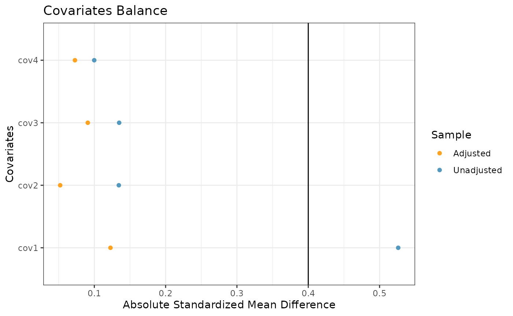
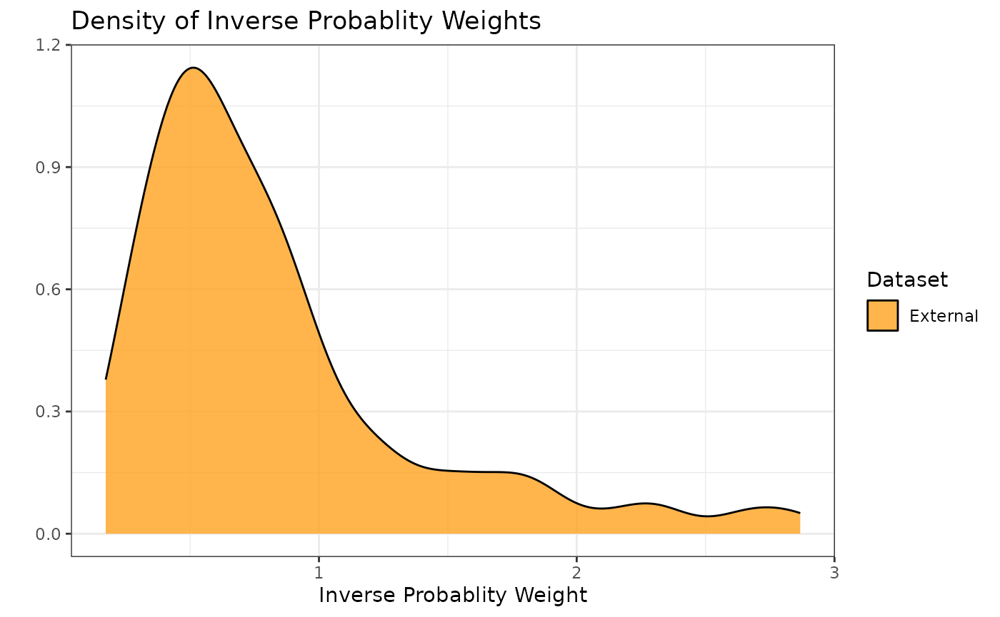
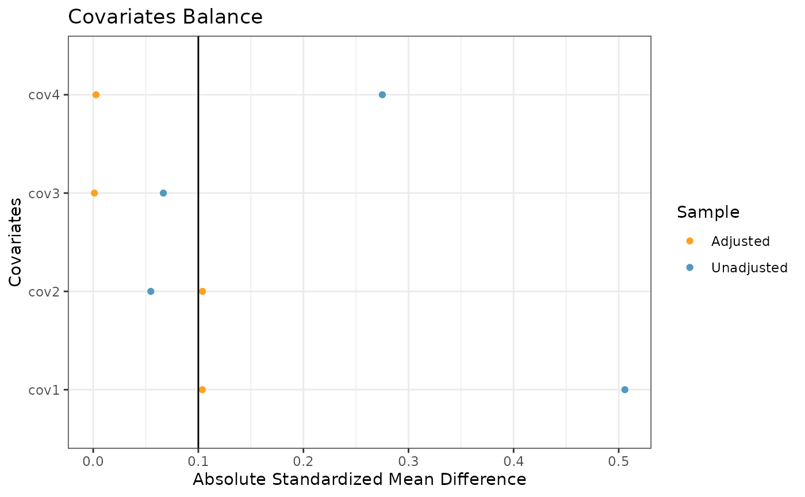
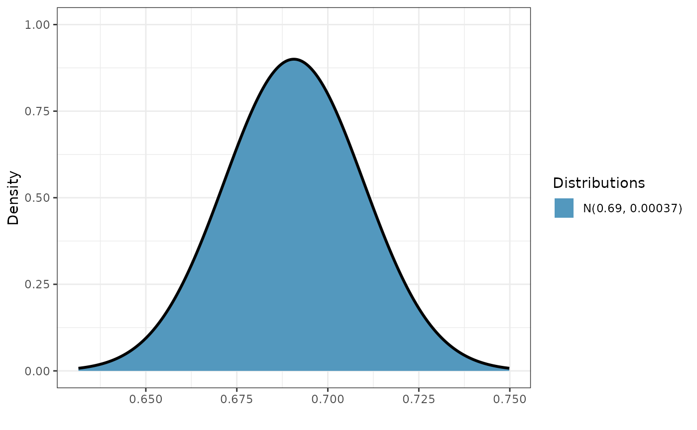
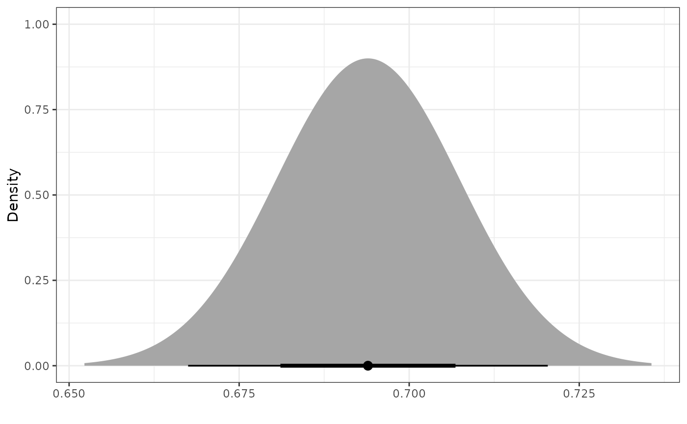
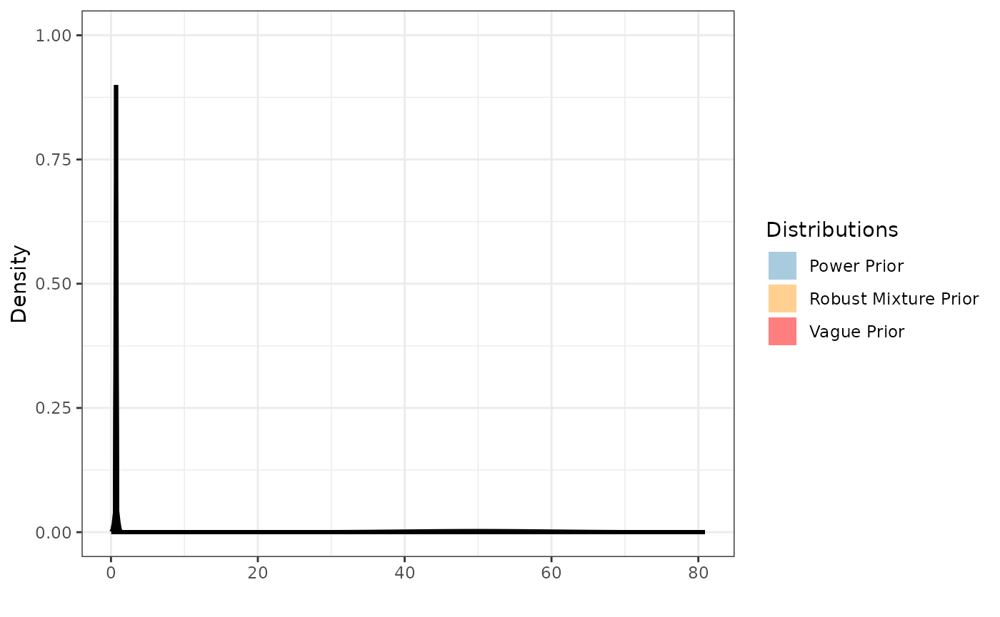
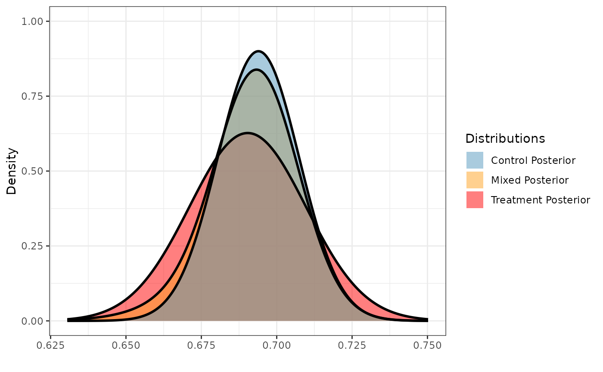
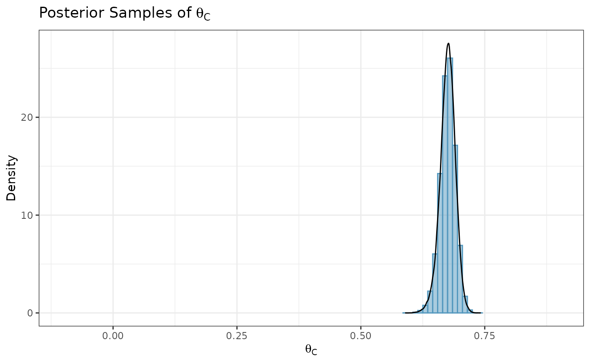
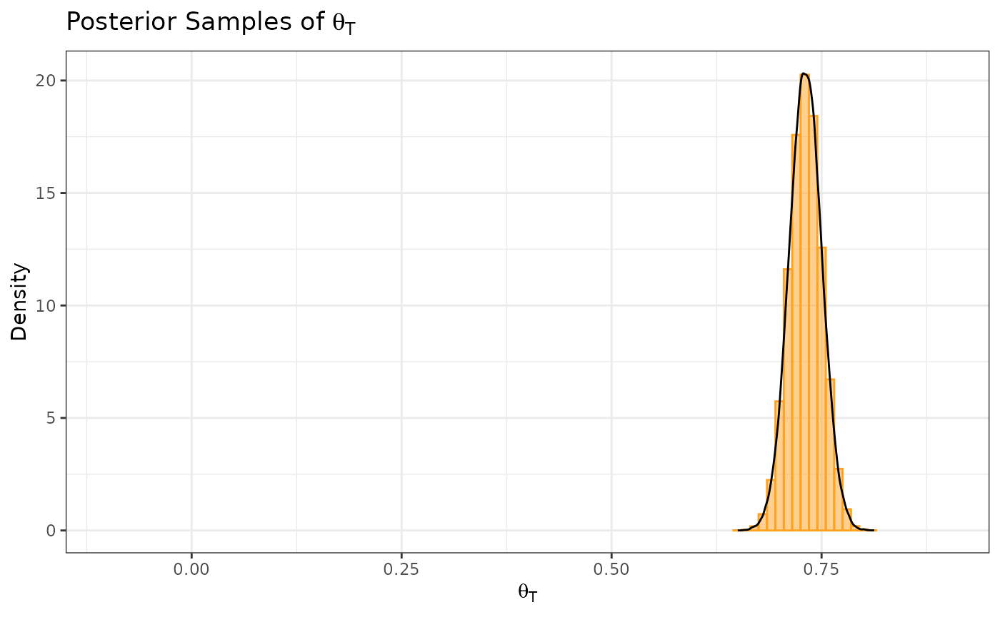
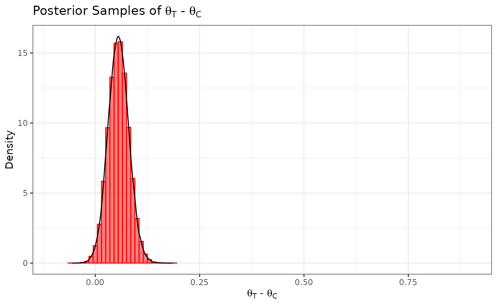

# Normal Outcome (Known SD)

## Introduction

In this example, we illustrate how to use Bayesian dynamic borrowing
(BDB) with the inclusion of inverse probability weighting to balance
baseline covariate distributions between external and internal datasets
(Psioda et al., [2025](https://doi.org/10.1080/10543406.2025.2489285)).
This particular example considers a hypothetical trial with a cross
sectional normal outcome and a known standard deviation (SD) in each
treatment arm (external control arm and both internal arms), and our
objective is to use BDB with IPWs to construct a posterior distribution
for the control mean $\theta_{C}$.

## Data Description

We will use simulated internal and external datasets from the package
where each dataset has a normally distributed response variable and four
baseline covariates which we will balance.

The external control dataset has a sample size of 150 participants, and
the distributions of the four covariates are as follows:

- Covariate 1: normal with a mean and standard deviation of
  approximately 50 and 10, respectively

- Covariate 2: binary (0 vs. 1) with approximately 20% of participants
  with level 1

- Covariate 3: binary (0 vs. 1) with approximately 60% of participants
  with level 1

- Covariate 4: binary (0 vs. 1) with approximately 30% of participants
  with level 1

The internal dataset has 120 participants with 60 participants in each
of the control and active treatment arms. The covariate distributions of
each arm are as follows:

- Covariate 1: normal with a mean and standard deviation of
  approximately 55 and 8, respectively

- Covariate 2: binary (0 vs. 1) with approximately 30% of participants
  with level 1

- Covariate 3: binary (0 vs. 1) with approximately 50% of participants
  with level 1

- Covariate 4: binary (0 vs. 1) with approximately 30% of participants
  with level 1

We assume the standard deviations of both the external and internal
response data are known and equal to 0.15.

``` r
library(tibble)
library(distributional)
library(dplyr)
#> 
#> Attaching package: 'dplyr'
#> The following objects are masked from 'package:stats':
#> 
#>     filter, lag
#> The following objects are masked from 'package:base':
#> 
#>     intersect, setdiff, setequal, union
library(ggplot2)
set.seed(1234)

summary(int_norm_df)
#>      subjid            cov1            cov2             cov3       
#>  Min.   :  1.00   Min.   :32.00   Min.   :0.0000   Min.   :0.0000  
#>  1st Qu.: 30.75   1st Qu.:49.00   1st Qu.:0.0000   1st Qu.:0.0000  
#>  Median : 60.50   Median :55.00   Median :0.0000   Median :1.0000  
#>  Mean   : 60.50   Mean   :54.16   Mean   :0.2833   Mean   :0.5083  
#>  3rd Qu.: 90.25   3rd Qu.:59.00   3rd Qu.:1.0000   3rd Qu.:1.0000  
#>  Max.   :120.00   Max.   :69.00   Max.   :1.0000   Max.   :1.0000  
#>       cov4           trt            y            
#>  Min.   :0.00   Min.   :0.0   Min.   :-0.009368  
#>  1st Qu.:0.00   1st Qu.:0.0   1st Qu.: 0.515350  
#>  Median :0.00   Median :0.5   Median : 0.683271  
#>  Mean   :0.25   Mean   :0.5   Mean   : 0.697266  
#>  3rd Qu.:0.25   3rd Qu.:1.0   3rd Qu.: 0.869011  
#>  Max.   :1.00   Max.   :1.0   Max.   : 1.399801
summary(ex_norm_df)
#>      subjid            cov1            cov2             cov3          cov4    
#>  Min.   :  1.00   Min.   :27.00   Min.   :0.0000   Min.   :0.0   Min.   :0.0  
#>  1st Qu.: 38.25   1st Qu.:42.00   1st Qu.:0.0000   1st Qu.:0.0   1st Qu.:0.0  
#>  Median : 75.50   Median :48.00   Median :0.0000   Median :0.5   Median :0.0  
#>  Mean   : 75.50   Mean   :49.03   Mean   :0.2267   Mean   :0.5   Mean   :0.3  
#>  3rd Qu.:112.75   3rd Qu.:55.00   3rd Qu.:0.0000   3rd Qu.:1.0   3rd Qu.:1.0  
#>  Max.   :150.00   Max.   :75.00   Max.   :1.0000   Max.   :1.0   Max.   :1.0  
#>        y          
#>  Min.   :-0.2778  
#>  1st Qu.: 0.3669  
#>  Median : 0.5921  
#>  Mean   : 0.5893  
#>  3rd Qu.: 0.8277  
#>  Max.   : 1.3438
sd_external_control <- 0.15
sd_internal_control <- 0.15
sd_internal_treated <- 0.15
```

## Propensity Scores and Inverse Probability Weights

With the covariate data from both the external and internal datasets, we
can calculate the propensity scores and ATT inverse probability weights
(IPWs) for the internal and external control participants using the
`calc_prop_scr` function. This creates a propensity score object which
we can use for calculating an inverse probability weighted power prior
in the next step.

**Note: when reading external and internal datasets into
`calc_prop_scr`, be sure to include only the arms in which you want to
balance the covariate distributions (typically the internal and external
control arms).** In this example, we want to balance the covariate
distributions of the external control arm to be similar to those of the
internal control arm, so we will exclude the internal active treatment
arm data from this function.

``` r
ps_model <- ~ cov1 + cov2 + cov3 + cov4
ps_obj <- calc_prop_scr(internal_df = filter(int_norm_df, trt == 0), 
                        external_df = ex_norm_df, 
                        id_col = subjid,
                        model = ps_model)

ps_obj
#> 
#> ── Model ───────────────────────────────────────────────────────────────────────
#> • cov1 + cov2 + cov3 + cov4
#> 
#> ── Propensity Scores and Weights ───────────────────────────────────────────────
#> • Effective sample size of the external arm: 61
#> # A tibble: 150 × 4
#>    subjid Internal `Propensity Score` `Inverse Probability Weight`
#>     <int> <lgl>                 <dbl>                        <dbl>
#>  1      1 FALSE                 0.181                        0.221
#>  2      2 FALSE                 0.351                        0.542
#>  3      3 FALSE                 0.456                        0.840
#>  4      4 FALSE                 0.115                        0.130
#>  5      5 FALSE                 0.364                        0.572
#>  6      6 FALSE                 0.377                        0.604
#>  7      7 FALSE                 0.131                        0.150
#>  8      8 FALSE                 0.259                        0.349
#>  9      9 FALSE                 0.235                        0.308
#> 10     10 FALSE                 0.207                        0.261
#> # ℹ 140 more rows
#> 
#> ── Absolute Standardized Mean Difference ───────────────────────────────────────
#> # A tibble: 4 × 3
#>   covariate diff_unadj diff_adj
#>   <chr>          <dbl>    <dbl>
#> 1 cov1          0.506   0.104  
#> 2 cov2          0.0548  0.104  
#> 3 cov3          0.0667  0.00115
#> 4 cov4          0.275   0.00266
```

In order to check the suitability of the external data, we can create a
variety of diagnostic plots. The first plot we might want is a histogram
of the overlapping propensity score distributions from both datasets. To
get this, we use the `prop_scr_hist` function. This function takes in
the propensity score object made in the previous step, and we can
optionally supply the variable we want to look at (either the propensity
score or the IPW). By default, it will plot the propensity scores.
Additionally, we can look at the densities rather than histograms by
using the `prop_scr_dens` function. When looking at the IPWs with either
the histogram or the density functions, it is important to note that
only the IPWs for external control participants will be shown because
the ATT IPWs for all internal control participants are equal to 1.

``` r
prop_scr_hist(ps_obj)
```



``` r
prop_scr_dens(ps_obj, variable = "ipw")
```



The final plot we might want to look at is a love plot to visualize the
absolute standardized mean differences (both unadjusted and adjusted by
the IPWs) of the covariates between the internal and external data. To
do this, we use the `prop_scr_love` function. Like the previous
function, the only required parameter for this function is the
propensity score object, but we can also provide a location along the
x-axis for a vertical reference line.

``` r
prop_scr_love(ps_obj, reference_line = 0.1)
```



## Inverse Probability Weighted Power Prior

Now that we have created and assessed our propensity score object, we
can read it into the `calc_power_prior_norm` function to calculate a
normal inverse probability weighted power prior for $\theta_{C}$. To
calculate the power prior, we need to supply the following information:

- weighted object (the propensity score object we created above)

- response variable name (in this case $y$)

- initial prior, in the form of a normal distributional object (e.g.,
  $\text{N}\left( 0.5,\text{sd} = 10 \right)$)

- SD of the external control response data, assumed known

The prior and the external control SD are optional. If no prior is
provided, an improper uniform prior will be used for the initial prior;
i.e., $\pi\left( \theta_{C} \right) \propto 1$. If no external control
SD or initial prior are specified (i.e., both the `prior` and
`external_sd` arguments are set as `NULL`), then a non-standardized $t$
power prior will be created (not covered in this vignette). In this
example, we define the initial prior to be a vague normal distribution
with a mean 0.5 and SD 10.

Once we have a power prior, we might want to plot it. To do that, we use
the `plot_dist` function.

``` r
pwr_prior <- calc_power_prior_norm(ps_obj,
                                   response = y,
                                   prior = dist_normal(0.5, 10), 
                                   external_sd = sd_external_control)
plot_dist(pwr_prior)
```



## Inverse Probability Weighted Robust Mixture Prior

We can robustify the normal power prior for $\theta_{C}$ by adding a
vague component to create a robust mixture prior (RMP). We define the
vague component to be a normal distribution with the same mean as the
power prior and a variance that is $n_{ex}$ times greater than the
variance of the power prior, where $n_{ex}$ denotes the sample size of
the external control arm. To construct the RMP with two components, we
use the `robustify_norm` function and place 0.5 weight on each
component. The two components of the resulting RMP are labeled as
“informative” and “vague”.

As an alternative to using `robustify_norm`, we can instead use the
`dist_mixture` function to create a mixture prior with an arbitrary
number of normal and/or $t$ components. If any component of the prior is
a $t$ distribution, the component will be approximated with the mixture
of two normal distributions.

``` r
n_external <- nrow(ex_norm_df)
mix_prior <- robustify_norm(pwr_prior, n_external, weights = c(0.5, 0.5))
plot_dist("Power Prior" = pwr_prior,
          "Vague Prior" = dist_normal(mean = mix_means(mix_prior)["vague"],
                                      sd = mix_sigmas(mix_prior)["vague"]),
          "Robust Mixture Prior" = mix_prior)
```



## Posterior Distributions

To create a posterior distribution for $\theta_{C}$, we can pass the
resulting RMP to the `calc_post_norm` function. By assuming the SD of
the internal response data to be known, the resulting posterior
distribution is also a mixture of normal components (the case when the
SD is unknown is not covered in this vignette).

**Note: when reading internal data directly into `calc_post_norm`, be
sure to include only the arm of interest (e.g., the internal control arm
if creating a posterior distribution for $\theta_{C}$).**

``` r
post_control <- calc_post_norm(filter(int_norm_df, trt == 0),
                               response = y, 
                               prior = mix_prior,
                               internal_sd = sd_internal_control)
plot_dist(post_control)
```



Next, we create a posterior distribution for the mean of the active
treatment arm $\theta_{T}$ by reading the internal data for the
corresponding arm into the `calc_post_norm` function while assuming the
SD of the internal active treatment arm to be equal to 0.15. In this
case, we use the vague component of the RMP as our normal prior.

**As noted earlier, be sure to read in only the data for the internal
active treatment arm while excluding the internal control data.**

``` r
post_treated <- calc_post_norm(internal_data = filter(int_norm_df, trt == 1),
                               response = y,
                               prior = dist_normal(mean = mix_means(mix_prior)["vague"],
                                                   sd = mix_sigmas(mix_prior)["vague"]),
                               internal_sd = sd_internal_treated)
plot_dist("Control Posterior" = post_control,
          "Treatment Posterior" = post_treated)
```



## Posterior Summary Statistics and Samples

With our posterior distributions for $\theta_{C}$ and $\theta_{T}$ saved
as distributional objects, we can use several functions from the
`distributional` package to calculate posterior summary statistics and
sample from the distributions. Using the posterior distribution for
$\theta_{C}$ as an example, we illustrate several of these functions
below.

- Posterior summary statistics:

``` r
c(mean = mean(post_control),
  median = median(post_control),
  variance = variance(post_control))
#>        mean      median    variance 
#> 0.675091383 0.675734273 0.000239683
```

- Highest density regions using the `hdr` function:

``` r
hdr(post_control)        # 95% HDR
#> <hdr[1]>
#> [1] [0.6442579, 0.7052676]95
hdr(post_control, 90)    # 90% HDR
#> <hdr[1]>
#> [1] [0.650438, 0.7006585]90
```

- Credible intervals using either the `hilo` function or the `quantile`
  function:

``` r
hilo(post_control)       # 95% credible interval
#> <hilo[1]>
#> [1] [0.6420707, 0.7036551]95
hilo(post_control, 90)   # 90% credible interval
#> <hilo[1]>
#> [1] [0.6487183, 0.6992243]90
quantile(post_control, c(.025, .975))[[1]]    # 95% CrI via quantile function
#> [1] 0.6420707 0.7036551
```

- Posterior probabilities (e.g., $Pr\left( \theta_{C} < 0.7|D \right)$)
  using the `cdf` function:

``` r
cdf(post_control, q = .7)   # Pr(theta_C < 0.7 | D)
#> [1] 0.9554074
```

- Posterior (log) densities at a given value:

``` r
density(post_control, at = .7)                # density at 0.7
#> [1] 6.659121
density(post_control, at = .7, log = TRUE)    # log density at 0.7
#> [1] 1.895988
```

In addition to calculating posterior summary statistics, we can sample
from posterior distributions using the `generate` function. Here, we
randomly sample 100,000 draws from the posterior distribution for
$\theta_{C}$ and plot a histogram of the sample.

``` r
samp_control <- generate(x = post_control, times = 100000)[[1]]
ggplot(data.frame(samp = samp_control), aes(x = samp)) +
  labs(y = "Density", x = expression(theta[C])) +
  ggtitle(expression(paste("Posterior Samples of ", theta[C]))) +
  geom_histogram(aes(y = after_stat(density)), color = "#5398BE", fill = "#5398BE",
                 position = "identity", binwidth = .01, alpha = 0.5) +
  geom_density(color = "black") +
  coord_cartesian(xlim = c(-0.1, 0.9)) +
  theme_bw()
```



Similarly, we sample from the posterior distribution for $\theta_{T}$.

``` r
samp_treated <- generate(x = post_treated, times = 100000)[[1]]
ggplot(data.frame(samp = samp_treated), aes(x = samp)) +
  labs(y = "Density", x = expression(theta[T])) +
  ggtitle(expression(paste("Posterior Samples of ", theta[T]))) +
  geom_histogram(aes(y = after_stat(density)), color = "#FFA21F", fill = "#FFA21F",
                 position = "identity", binwidth = .01, alpha = 0.5) +
  geom_density(color = "black") +
  coord_cartesian(xlim = c(-0.1, 0.9)) +
  theme_bw()
```



We define our marginal treatment effect to be the difference between the
active treatment mean and the control mean (i.e.,
$\theta_{T} - \theta_{C}$). We can obtain a sample from the posterior
distribution for $\theta_{T} - \theta_{C}$ by subtracting the posterior
sample of $\theta_{C}$ from the posterior sample of $\theta_{T}$.

``` r
samp_trt_diff <- samp_treated - samp_control
ggplot(data.frame(samp = samp_trt_diff), aes(x = samp)) +
  labs(y = "Density", x = expression(paste(theta[T], " - ", theta[C]))) +
  ggtitle(expression(paste("Posterior Samples of ", theta[T], " - ", theta[C]))) +
  geom_histogram(aes(y = after_stat(density)), color = "#FF0000", fill = "#FF0000",
                 position = "identity", binwidth = .01, alpha = 0.5) +
  geom_density(color = "black") +
  coord_cartesian(xlim = c(-0.1, 0.9)) +
  theme_bw()
```



Suppose we want to test the hypotheses
$H_{0}:\theta_{T} - \theta_{C} \leq 0$ versus
$H_{1}:\theta_{T} - \theta_{C} > 0$. We can use our posterior sample for
$\theta_{T} - \theta_{C}$ to calculate the posterior probability
$Pr\left( \theta_{T} - \theta_{C} > 0 \mid D \right)$ (i.e., the
probability in favor of $H_{1}$), and we conclude that we have
sufficient evidence in favor of the alternative hypothesis if
$Pr\left( \theta_{T} - \theta_{C} > 0 \mid D \right) > 0.975$.

``` r
mean(samp_trt_diff > 0)
#> [1] 0.98861
```

We see that this posterior probability is greater than 0.975, and hence
we have sufficient evidence to support the alternative hypothesis.

Using the `parameters` function from the `distributional` package, we
can extract the parameters of a posterior distribution that consists of
a single component (i.e., a single normal distribution). For example, we
can extract the mean (mu) and standard deviation (sigma) parameters of
the beta posterior distribution for $\theta_{T}$.

``` r
parameters(post_treated)
#>          mu      sigma
#> 1 0.7307423 0.01929926
```

For posterior distributions that are a mixture of normal components, we
can extract the means and standard deviations of each component using
the `mix_means` and `mix_sigmas` functions, respectively.

``` r
mix_means(post_control)    # means of each normal component
#> informative       vague 
#>   0.6772442   0.6636995
mix_sigmas(post_control)   # SDs of each normal component
#> informative       vague 
#>  0.01361736  0.01929926
```

We can also use the `parameters` function to extract the mixture weights
associated with the normal components of the posterior distribution for
$\theta_{C}$.

``` r
parameters(post_control)$w[[1]]
#> informative       vague 
#>   0.8410606   0.1589394
```

Lastly, we calculate the effective sample size of the posterior
distribution for $\theta_{C}$ using the method by Pennello and Thompson
(2008). To do so, we first must construct the posterior distribution of
$\theta_{C}$*without borrowing from the external control data* (e.g.,
using a vague prior).

``` r
post_control_no_brrw <- calc_post_norm(filter(int_norm_df, trt == 0),
                                       response = y,
                                       prior = dist_normal(mean = mix_means(mix_prior)["vague"],
                                                           sd = mix_sigmas(mix_prior)["vague"]),
                                       internal_sd = sd_internal_control)
n_int_ctrl <- nrow(filter(int_norm_df, trt == 0))   # sample size of internal control arm
var_no_brrw <- variance(post_control_no_brrw)       # post variance of theta_C without borrowing
var_brrw <- variance(post_control)                  # post variance of theta_C with borrowing
ess <- n_int_ctrl * var_no_brrw / var_brrw          # effective sample size
ess
#> [1] 93.23853
```

## References

Psioda, M. A., Bean, N. W., Wright, B. A., Lu, Y., Mantero, A., and
Majumdar, A. (2025). Inverse probability weighted Bayesian dynamic
borrowing for estimation of marginal treatment effects with application
to hybrid control arm oncology studies. *Journal of Biopharmaceutical
Statistics*, 1–23. DOI:
[10.1080/10543406.2025.2489285](https://doi.org/10.1080/10543406.2025.2489285).
