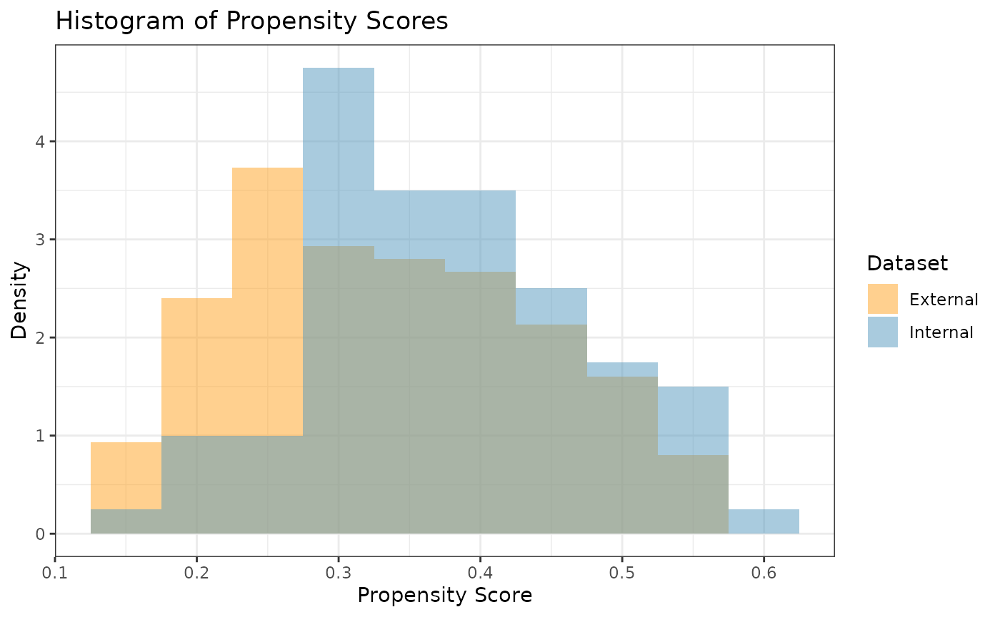
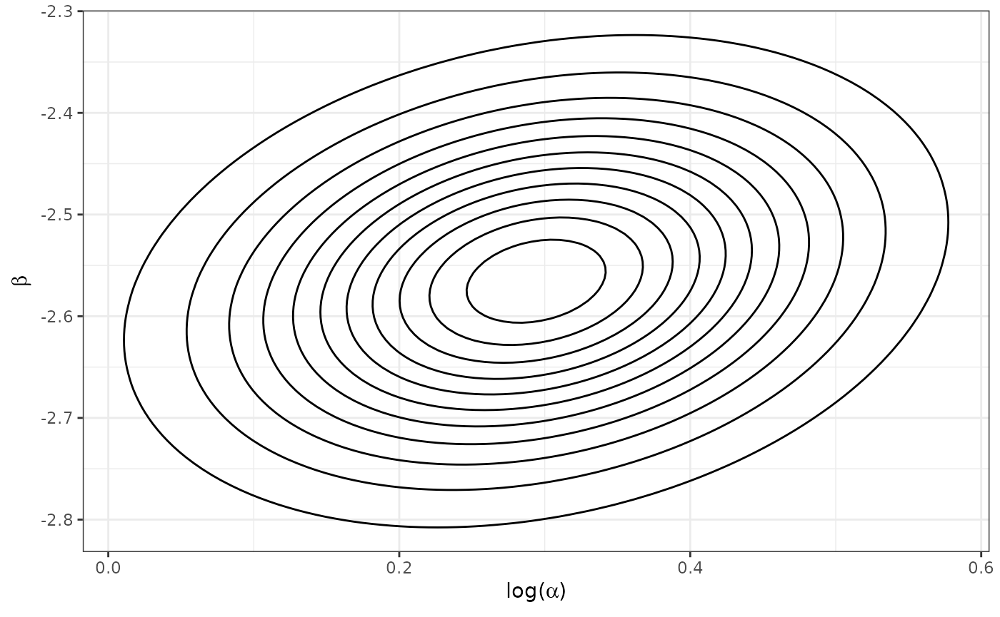
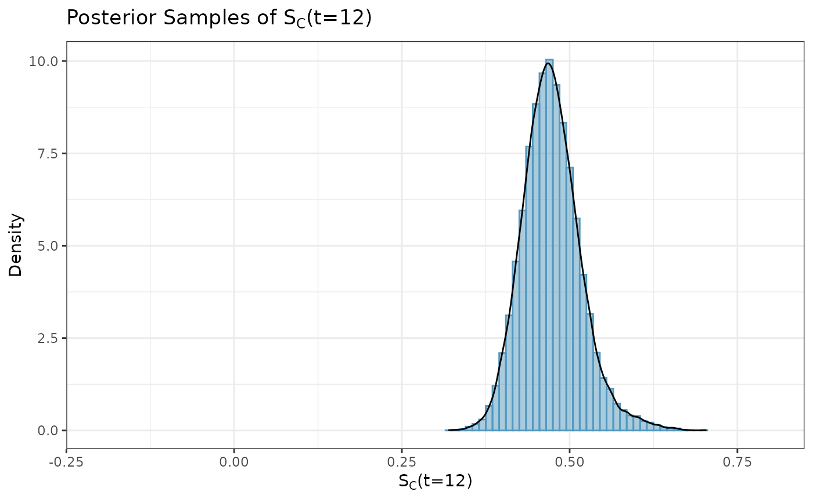
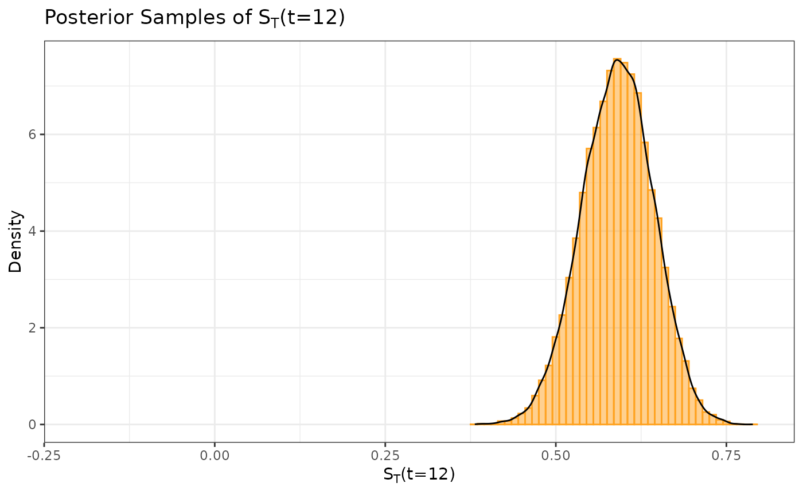
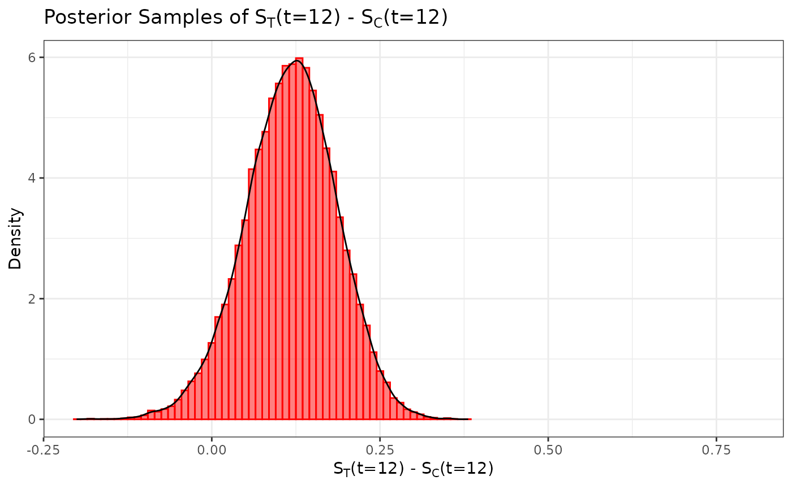

# Time-to-Event Outcome

## Introduction

In this example, we illustrate how to use Bayesian dynamic borrowing
(BDB) with the inclusion of inverse probability weighting to balance
baseline covariate distributions between external and internal datasets
(Psioda et al., [2025](https://doi.org/10.1080/10543406.2025.2489285)).
This particular example considers a hypothetical trial with a
time-to-event outcome which we assume to follow a Weibull distribution;
i.e., $Y_{i} \sim \text{Weibull}(\alpha,\sigma)$ where
$$f\left( y_{i} \mid \alpha,\sigma \right) = \left( \frac{\alpha}{\sigma} \right)\left( \frac{y_{i}}{\sigma} \right)^{\alpha - 1}\exp\left( - \left( \frac{y_{i}}{\sigma} \right)^{\alpha} \right).$$
Define ${\mathbf{θ}} = \{\log(\alpha),\beta\}$ where
$\beta = - \log(\sigma)$ is the intercept (i.e., log-inverse-scale)
parameter of a Weibull proportional hazards regression model and
$\alpha$ is the shape parameter.

Our objective is to use BDB with IPWs to construct a posterior
distribution for the probability of surviving past time $t$ in the
control arm, $S_{C}\left( t|{\mathbf{θ}} \right)$ (hereafter denoted as
$S_{C}(t)$ for notational convenience). For each treatment arm, we will
define our prior distributions with respect to $\mathbf{θ}$ before
eventually obtaining MCMC samples from the posterior distributions of
$S_{C}(t)$ and $S_{T}(t)$ (i.e., the survival probability at time $t$
for the active treatment arm). In this example, suppose we are
interested in survival probabilities at $t = 12$ months.

## Data Description

We will use simulated internal and external datasets from the package
where each dataset has a time-to-event response variable (the observed
time at which a participant either had an event or was censored), an
event indicator (1: event; 0: censored), the enrollment time in the
study, the total time since the start of the study, and four baseline
covariates which we will balance.

The external control dataset has a sample size of 150 participants, and
the distributions of the four covariates are as follows:

- Covariate 1: normal with a mean and standard deviation of
  approximately 65 and 10, respectively

- Covariate 2: binary (0 vs. 1) with approximately 30% of participants
  with level 1

- Covariate 3: binary (0 vs. 1) with approximately 40% of participants
  with level 1

- Covariate 4: binary (0 vs. 1) with approximately 50% of participants
  with level 1

The internal dataset has 160 participants with 80 participants in each
of the control arm and the active treatment arms. The covariate
distributions of each arm are as follows:

- Covariate 1: normal with a mean and standard deviation of
  approximately 62 and 8, respectively

- Covariate 2: binary (0 vs. 1) with approximately 40% of participants
  with level 1

- Covariate 3: binary (0 vs. 1) with approximately 40% of participants
  with level 1

- Covariate 4: binary (0 vs. 1) with approximately 60% of participants
  with level 1

``` r
library(tibble)
library(distributional)
library(dplyr)
#> 
#> Attaching package: 'dplyr'
#> The following objects are masked from 'package:stats':
#> 
#>     filter, lag
#> The following objects are masked from 'package:base':
#> 
#>     intersect, setdiff, setequal, union
library(ggplot2)
library(rstan)
#> Loading required package: StanHeaders
#> 
#> rstan version 2.32.7 (Stan version 2.32.2)
#> For execution on a local, multicore CPU with excess RAM we recommend calling
#> options(mc.cores = parallel::detectCores()).
#> To avoid recompilation of unchanged Stan programs, we recommend calling
#> rstan_options(auto_write = TRUE)
#> For within-chain threading using `reduce_sum()` or `map_rect()` Stan functions,
#> change `threads_per_chain` option:
#> rstan_options(threads_per_chain = 1)
set.seed(1234)

summary(int_tte_df)
#>      subjid             y              enr_time         total_time    
#>  Min.   :  1.00   Min.   : 0.7026   Min.   :0.01367   Min.   : 1.309  
#>  1st Qu.: 40.75   1st Qu.: 6.4188   1st Qu.:0.83781   1st Qu.: 7.268  
#>  Median : 80.50   Median :12.1179   Median :1.27502   Median :14.245  
#>  Mean   : 80.50   Mean   : 9.6651   Mean   :1.19144   Mean   :15.427  
#>  3rd Qu.:120.25   3rd Qu.:12.7287   3rd Qu.:1.58949   3rd Qu.:20.699  
#>  Max.   :160.00   Max.   :13.9913   Max.   :1.98912   Max.   :58.644  
#>      event           trt           cov1            cov2             cov3       
#>  Min.   :0.00   Min.   :0.0   Min.   :46.00   Min.   :0.0000   Min.   :0.0000  
#>  1st Qu.:0.00   1st Qu.:0.0   1st Qu.:57.00   1st Qu.:0.0000   1st Qu.:0.0000  
#>  Median :0.00   Median :0.5   Median :62.00   Median :0.0000   Median :0.0000  
#>  Mean   :0.45   Mean   :0.5   Mean   :61.83   Mean   :0.3688   Mean   :0.3625  
#>  3rd Qu.:1.00   3rd Qu.:1.0   3rd Qu.:67.00   3rd Qu.:1.0000   3rd Qu.:1.0000  
#>  Max.   :1.00   Max.   :1.0   Max.   :85.00   Max.   :1.0000   Max.   :1.0000  
#>       cov4       
#>  Min.   :0.0000  
#>  1st Qu.:0.0000  
#>  Median :1.0000  
#>  Mean   :0.5563  
#>  3rd Qu.:1.0000  
#>  Max.   :1.0000
summary(ex_tte_df)
#>      subjid             y               enr_time          total_time    
#>  Min.   :  1.00   Min.   : 0.05804   Min.   :0.005329   Min.   : 1.191  
#>  1st Qu.: 38.25   1st Qu.: 4.45983   1st Qu.:0.857692   1st Qu.: 5.782  
#>  Median : 75.50   Median : 9.42003   Median :1.308708   Median :10.576  
#>  Mean   : 75.50   Mean   : 8.58877   Mean   :1.232657   Mean   :12.533  
#>  3rd Qu.:112.75   3rd Qu.:12.71370   3rd Qu.:1.673582   3rd Qu.:16.549  
#>  Max.   :150.00   Max.   :14.00703   Max.   :1.975702   Max.   :64.793  
#>      event             cov1            cov2             cov3       
#>  Min.   :0.0000   Min.   :37.00   Min.   :0.0000   Min.   :0.0000  
#>  1st Qu.:0.0000   1st Qu.:58.00   1st Qu.:0.0000   1st Qu.:0.0000  
#>  Median :1.0000   Median :64.00   Median :0.0000   Median :0.0000  
#>  Mean   :0.6267   Mean   :64.28   Mean   :0.3533   Mean   :0.4533  
#>  3rd Qu.:1.0000   3rd Qu.:70.00   3rd Qu.:1.0000   3rd Qu.:1.0000  
#>  Max.   :1.0000   Max.   :90.00   Max.   :1.0000   Max.   :1.0000  
#>       cov4       
#>  Min.   :0.0000  
#>  1st Qu.:0.0000  
#>  Median :0.0000  
#>  Mean   :0.4733  
#>  3rd Qu.:1.0000  
#>  Max.   :1.0000
```

## Propensity Scores and Inverse Probability Weights

With the covariate data from both the external and internal datasets, we
can calculate the propensity scores and ATT inverse probability weights
(IPWs) for the internal and external control participants using the
`calc_prop_scr` function. This creates a propensity score object which
we can use for calculating an approximate inverse probability weighted
power prior in the next step.

**Note: when reading external and internal datasets into
`calc_prop_scr`, be sure to include only the arms in which you want to
balance the covariate distributions (typically the internal and external
control arms).** In this example, we want to balance the covariate
distributions of the external control arm to be similar to those of the
internal control arm, so we will exclude the internal active treatment
arm data from this function.

``` r
ps_obj <- calc_prop_scr(internal_df = filter(int_tte_df, trt == 0),
                        external_df = ex_tte_df,
                        id_col = subjid,
                        model = ~ cov1 + cov2 + cov3 + cov4)
ps_obj
#> 
#> ── Model ───────────────────────────────────────────────────────────────────────
#> • cov1 + cov2 + cov3 + cov4
#> 
#> ── Propensity Scores and Weights ───────────────────────────────────────────────
#> • Effective sample size of the external arm: 81
#> # A tibble: 150 × 4
#>    subjid Internal `Propensity Score` `Inverse Probability Weight`
#>     <int> <lgl>                 <dbl>                        <dbl>
#>  1      1 FALSE                 0.333                        0.500
#>  2      2 FALSE                 0.288                        0.405
#>  3      3 FALSE                 0.539                        1.17 
#>  4      4 FALSE                 0.546                        1.20 
#>  5      5 FALSE                 0.344                        0.524
#>  6      6 FALSE                 0.393                        0.646
#>  7      7 FALSE                 0.390                        0.639
#>  8      8 FALSE                 0.340                        0.515
#>  9      9 FALSE                 0.227                        0.294
#> 10     10 FALSE                 0.280                        0.389
#> # ℹ 140 more rows
#> 
#> ── Absolute Standardized Mean Difference ───────────────────────────────────────
#> # A tibble: 4 × 3
#>   covariate diff_unadj diff_adj
#>   <chr>          <dbl>    <dbl>
#> 1 cov1          0.339  0.0461  
#> 2 cov2          0.0450 0.0204  
#> 3 cov3          0.160  0.000791
#> 4 cov4          0.308  0.00857
```

In order to check the suitability of the external data, we can create a
variety of diagnostic plots. The first plot we might want is a histogram
of the overlapping propensity score distributions from both datasets. To
get this, we use the `prop_scr_hist` function. This function takes in
the propensity score object made in the previous step, and we can
optionally supply the variable we want to look at (either the propensity
score or the IPW). By default, it will plot the propensity scores.
Additionally, we can look at the densities rather than histograms by
using the `prop_scr_dens` function. When looking at the IPWs with either
the histogram or the density functions, it is important to note that
only the IPWs for external control participants will be shown because
the ATT IPWs for all internal control participants are equal to 1.

``` r
prop_scr_hist(ps_obj)
```



``` r
prop_scr_dens(ps_obj, variable = "ipw")
```


The final plot we might want to look at is a love plot to visualize the
absolute standardized mean differences (both unadjusted and adjusted by
the IPWs) of the covariates between the internal and external data. To
do this, we use the `prop_scr_love` function. Like the previous
function, the only required parameter for this function is the
propensity score object, but we can also provide a location along the
x-axis for a vertical reference line.

``` r
prop_scr_love(ps_obj, reference_line = 0.1)
```


## Approximate Inverse Probability Weighted Power Prior

Now that we have created and assessed our propensity score object, we
can read it into the `calc_power_prior_weibull` function to calculate an
approximate inverse probability weighted power prior for $\mathbf{θ}$
under the control arm, which we denote as
${\mathbf{θ}}_{C} = \{\log\left( \alpha_{C} \right),\beta_{C}\}$.
Specifically, we approximate the power prior with a bivariate normal
distribution using one of two approximation methods: (1) Laplace
approximation or (2) estimation of the mean vector and covariance matrix
using MCMC samples from the unnormalized power prior (see the details
section of the `calc_power_prior_weibull` documentation for more
information). In this example, we use the Laplace approximation which is
considerably faster than the MCMC approach.

To approximate the power prior, we need to supply the following
information:

- weighted object (the propensity score object we created above)

- response variable name (in this case $y$)

- event indicator variable name (in this case $event$)

- initial prior for the intercept parameter, in the form of a normal
  distributional object (e.g.,
  $\text{N}\left( 0,\text{sd} = 10 \right)$)

- scale hyperparameter for the half-normal initial prior for the shape
  parameter

- approximation method (either “Laplace” or “MCMC”)

``` r
pwr_prior <- calc_power_prior_weibull(ps_obj,
                                      response = y,
                                      event = event,
                                      intercept = dist_normal(0, 10),
                                      shape = 50,
                                      approximation = "Laplace")
plot_dist(pwr_prior)
```



## Inverse Probability Weighted Robust Mixture Prior

We can robustify the approximate multivariate normal (MVN) power prior
for ${\mathbf{θ}}_{C}$ by adding a vague component to create a robust
mixture prior (RMP). We define the vague component to be a MVN
distribution with the same mean vector as the approximate power prior
and a covariance matrix that is equal to the covariance matrix of the
approximate power prior multiplied by $r_{ex}$, where $r_{ex}$ denotes
the number of observed events in the external control arm. To construct
this RMP, we can use either the `robustify_norm` or `robustify_mvnorm`
functions, and we place 0.5 weight on each component. The two components
of the resulting RMP are labeled as “informative” and “vague”.

We can print the mean vectors and covariance matrices of each MVN
component using the functions `mix_means` and `mix_sigmas`,
respectively.

``` r
r_external <- sum(ex_tte_df$event)   # number of observed events
mix_prior <- robustify_mvnorm(pwr_prior, r_external, weights = c(0.5, 0.5))   # RMP
mix_means(mix_prior)     # mean vectors
#> $informative
#> [1]  0.2940907 -2.5655689
#> 
#> $vague
#> [1]  0.2940907 -2.5655689
mix_sigmas(mix_prior)    # mean covariance matrices
#> $informative
#>             [,1]        [,2]
#> [1,] 0.016251652 0.003325476
#> [2,] 0.003325476 0.011868788
#> 
#> $vague
#>           [,1]      [,2]
#> [1,] 1.5276553 0.3125948
#> [2,] 0.3125948 1.1156660
#plot_dist(mix_prior)
```

## Posterior Distributions

To create a posterior distribution for ${\mathbf{θ}}_{C}$, we can pass
the resulting RMP and the internal control data to the
`calc_post_weibull` function which returns a stanfit object from which
we can extract the MCMC samples for the control parameters. In addition
to returning posterior samples for $\log\left( \alpha_{C} \right)$ and
$\beta_{C}$, the function returns posterior samples for the marginal
survival probability $S_{C}(t)$ where the time(s) $t$ can be specified
as either a scalar or vector of numbers using the `analysis_time`
argument.

**Note: when reading internal data directly into `calc_post_weibull`, be
sure to include only the arm of interest (e.g., the internal control arm
if creating a posterior distribution for ${\mathbf{θ}}_{C}$).**

``` r
post_control <- calc_post_weibull(filter(int_tte_df, trt == 0),
                                  response = y,
                                  event = event,
                                  prior = mix_prior,
                                  analysis_time = 12)
summary(post_control)$summary
#>                     mean      se_mean         sd         2.5%          25%
#> beta0         -2.6887252 0.0007416549 0.08973077   -2.8896461   -2.7388799
#> log_alpha      0.3621925 0.0007810625 0.10469515    0.1575300    0.2930159
#> alpha          1.4444037 0.0011479498 0.15277470    1.1706159    1.3404641
#> survProb[1]    0.4730793 0.0003307721 0.04382526    0.3949843    0.4439155
#> lp__        -148.4751404 0.0118123153 1.15276979 -151.6658488 -148.8919240
#>                     50%          75%        97.5%     n_eff      Rhat
#> beta0         -2.682493   -2.6292044   -2.5358069 14637.910 1.0000966
#> log_alpha      0.361368    0.4291120    0.5731935 17967.248 0.9999709
#> alpha          1.435292    1.5358930    1.7739230 17711.572 0.9999736
#> survProb[1]    0.470524    0.4987585    0.5702913 17554.608 1.0001324
#> lp__        -148.108591 -147.6609827 -147.3811442  9523.906 0.9999708
#plot_dist(post_control)
```

We can extract and plot the posterior samples of $S_{C}(t)$. Here, we
plot the samples using a histogram, however, additional posterior plots
(e.g., density curves, trace plots) can easily be obtained using the
`bayesplot` package.

``` r
surv_prob_control <- as.data.frame(extract(post_control, pars = c("survProb")))[,1]
ggplot(data.frame(samp = surv_prob_control), aes(x = samp)) +
  labs(y = "Density", x = expression(paste(S[C], "(t=12)"))) +
  ggtitle(expression(paste("Posterior Samples of ", S[C], "(t=12)"))) +
  geom_histogram(aes(y = after_stat(density)), color = "#5398BE", fill = "#5398BE",
                 position = "identity", binwidth = .01, alpha = 0.5) +
  geom_density(color = "black") +
  coord_cartesian(xlim = c(-0.2, 0.8)) +
  theme_bw()
```



Next, we create a posterior distribution for the survival probability
$S_{T}(t)$ for the active treatment arm at time $t = 12$ by reading the
internal data for the corresponding arm into the `calc_post_weibull`
function. In this case, we use the vague component of the RMP as our MVN
prior.

**As noted earlier, be sure to read in only the data for the internal
active treatment arm while excluding the internal control data.**

``` r
vague_prior <- dist_multivariate_normal(mu = list(mix_means(mix_prior)[[2]]),
                                        sigma = list(mix_sigmas(mix_prior)[[2]]))
post_treated <- calc_post_weibull(filter(int_tte_df, trt == 1),
                                  response = y,
                                  event = event,
                                  prior = vague_prior,
                                  analysis_time = 12)
summary(post_treated)$summary
#>                     mean      se_mean         sd          2.5%          25%
#> beta0         -2.9467394 0.0014810376 0.14726947   -3.26991147   -3.0353030
#> log_alpha      0.3526892 0.0015533881 0.15956920    0.02989851    0.2470030
#> alpha          1.4409985 0.0022038801 0.22910480    1.03034996    1.2801829
#> survProb[1]    0.5903455 0.0003800737 0.05223538    0.48591817    0.5548152
#> lp__        -141.7011034 0.0098800342 1.02027824 -144.47671402 -142.0942676
#>                      50%          75%        97.5%     n_eff      Rhat
#> beta0         -2.9322638   -2.8440318   -2.6968268  9887.653 0.9999780
#> log_alpha      0.3568371    0.4618120    0.6563501 10552.082 0.9999734
#> alpha          1.4288031    1.5869469    1.9277434 10806.684 0.9999703
#> survProb[1]    0.5911443    0.6259527    0.6894547 18888.340 1.0000317
#> lp__        -141.3906390 -140.9749554 -140.7038264 10664.005 0.9999849
#plot_dist(post_treated)
```

As was previously done, we can extract and plot the posterior samples of
$S_{T}(t)$.

``` r
surv_prob_treated <- as.data.frame(extract(post_treated, pars = c("survProb")))[,1]
ggplot(data.frame(samp = surv_prob_treated), aes(x = samp)) +
  labs(y = "Density", x = expression(paste(S[T], "(t=12)"))) +
  ggtitle(expression(paste("Posterior Samples of ", S[T], "(t=12)"))) +
  geom_histogram(aes(y = after_stat(density)), color = "#FFA21F", fill = "#FFA21F",
                 position = "identity", binwidth = .01, alpha = 0.5) +
  geom_density(color = "black") +
  coord_cartesian(xlim = c(-0.2, 0.8)) +
  theme_bw()
```



We define our marginal treatment effect to be the difference in survival
probabilities at 12 months between the active treatment and control arms
(i.e., $S_{T}(t = 12) - S_{C}(t = 12)$). We can obtain a sample from the
posterior distribution for $S_{T}(t = 12) - S_{C}(t = 12)$ by
subtracting the posterior sample of $S_{C}(t = 12)$ from the posterior
sample of $S_{T}(t = 12)$.

``` r
samp_trt_diff <- surv_prob_treated - surv_prob_control
ggplot(data.frame(samp = samp_trt_diff), aes(x = samp)) +
  labs(y = "Density", x = expression(paste(S[T], "(t=12) - ", S[C], "(t=12)"))) +
  ggtitle(expression(paste("Posterior Samples of ", S[T],
                           "(t=12) - ", S[C], "(t=12)"))) +
  geom_histogram(aes(y = after_stat(density)), color = "#FF0000", fill = "#FF0000",
                 position = "identity", binwidth = .01, alpha = 0.5) +
  geom_density(color = "black") +
  coord_cartesian(xlim = c(-0.2, 0.8)) +
  theme_bw()
```



## Posterior Summary Statistics

Suppose we want to test the hypotheses
$H_{0}:S_{T}(t = 12) - S_{C}(t = 12) \leq 0$ versus
$H_{1}:S_{T}(t = 12) - S_{C}(t = 12) > 0$. We can use our posterior
sample for $S_{T}(t = 12) - S_{C}(t = 12)$ to calculate the posterior
probability $Pr\left( S_{T}(t = 12) - S_{C}(t = 12) > 0 \mid D \right)$
(i.e., the probability in favor of $H_{1}$), and we conclude that we
have sufficient evidence in favor of the alternative hypothesis if
$Pr\left( S_{T}(t = 12) - S_{C}(t = 12) > 0 \mid D \right) > 0.975$.

``` r
mean(samp_trt_diff > 0)
#> [1] 0.9534667
```

We see that this posterior probability is less than 0.975, and hence we
do not have sufficient evidence in support of the alternative
hypothesis.

With MCMC samples from our posterior distributions, we can calculate
posterior summary statistics such as the mean, median, and standard
deviation. As an example, we calculate these statistics using the
posterior distribution for $S_{T}(t = 12) - S_{C}(t = 12)$.

``` r
c(mean = mean(samp_trt_diff),
  median = median(samp_trt_diff),
  SD = sd(samp_trt_diff))
#>       mean     median         SD 
#> 0.11726619 0.11920218 0.06795424
```

We can also calculate credible intervals using the `quantile` function.

``` r
quantile(samp_trt_diff, c(.025, .975))    # 95% CrI
#>        2.5%       97.5% 
#> -0.02240224  0.24521556
```

Lastly, we calculate the effective sample size of the posterior
distribution for $S_{C}(t = 12)$ using the method by Pennello and
Thompson (2008). To do so, we first must construct the posterior
distribution of $S_{C}(t = 12)$*without borrowing from the external
control data* (e.g., using a vague prior).

``` r
post_ctrl_no_brrw <- calc_post_weibull(filter(int_tte_df, trt == 0),
                                       response = y,
                                       event = event,
                                       prior = vague_prior,
                                       analysis_time = 12)
surv_prob_ctrl_nb <- as.data.frame(extract(post_ctrl_no_brrw, pars = c("survProb")))[,1]
n_int_ctrl <- nrow(filter(int_tte_df, trt == 0))  # sample size of internal control arm
var_no_brrw <- var(surv_prob_ctrl_nb)             # post variance of S_C(t) without borrowing
var_brrw <- var(surv_prob_control)                # post variance of S_C(t) with borrowing
ess <- n_int_ctrl * var_no_brrw / var_brrw        # effective sample size
ess
#> [1] 123.4881
```

## Simulation Studies

If you would like to run a simulation study for a time-to-event
endpoint, you can use the template code available
[here](https://github.com/GSK-Biostatistics/beastt/blob/main/inst/templates/tte-template.R).
This template code assumes an external dataset is avaliable. It contains
a step-by-step guide of how you can modify the code in the template to
fit your specific simulation needs as well as how to parallelize the
code to run more efficiently.

## References

Psioda, M. A., Bean, N. W., Wright, B. A., Lu, Y., Mantero, A., and
Majumdar, A. (2025). Inverse probability weighted Bayesian dynamic
borrowing for estimation of marginal treatment effects with application
to hybrid control arm oncology studies. *Journal of Biopharmaceutical
Statistics*, 1–23. DOI:
[10.1080/10543406.2025.2489285](https://doi.org/10.1080/10543406.2025.2489285).
